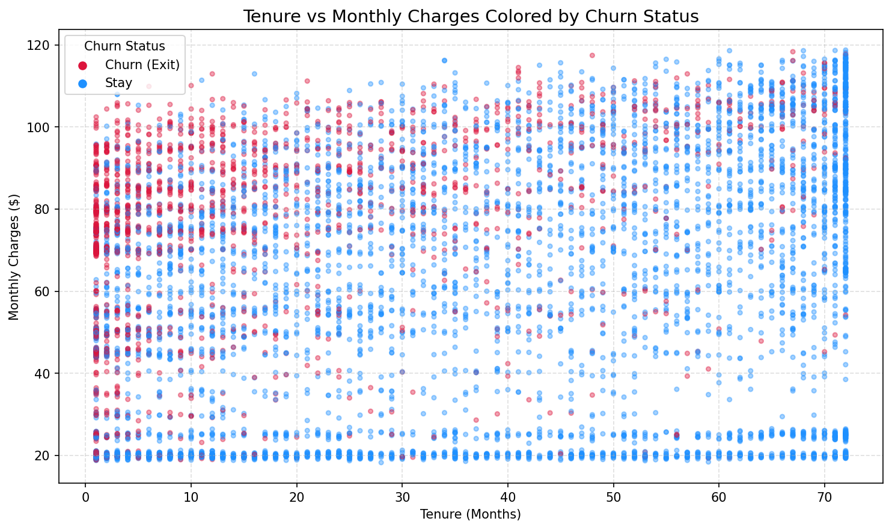
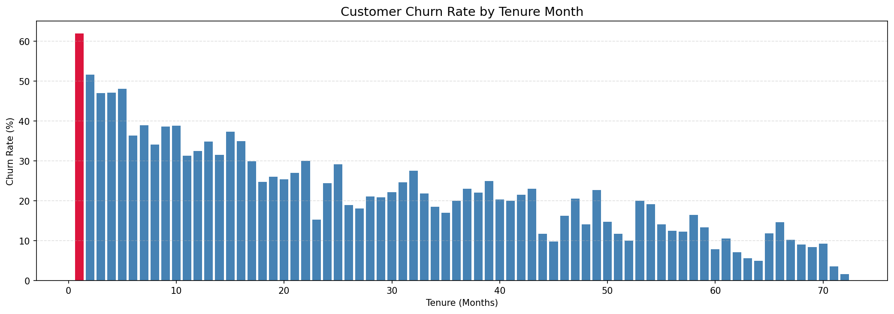

# Customer Churn Prediction: The Retention Playbook

A machine learning project that analyzes telecom customer data to identify **why customers leave** and predicts **which customers are at risk of churning**, using exploratory data analysis and a Logistic Regression classifier.


---

## Overview

Customer churn — when a subscriber stops doing business with a company — is one of the most expensive problems in the telecom industry, where acquiring a new customer costs far more than retaining an existing one. This project explores the **Telco Customer Churn** dataset to answer three questions:

1. **Who is leaving?** What does the relationship between tenure, monthly charges, and churn look like?
2. **When are they leaving?** Is there a specific point in the customer lifecycle where churn risk spikes?
3. **Can we predict it?** Can a simple, interpretable model flag at-risk customers before they leave?

The result is a trained Logistic Regression model along with two diagnostic visualizations that translate raw data into a clear retention narrative.

## Dataset

This project uses the [Telco Customer Churn dataset](https://www.kaggle.com/datasets/blastchar/telco-customer-churn) (originally published by IBM as a sample dataset), containing **7,043 customer records** across **21 features**, including demographics, account information, subscribed services, and churn status.

| | |
|---|---|
| Rows | 7,043 (7,032 after cleaning) |
| Features | 21 |
| Target | `Churn` (Yes / No) |
| Class balance | 26.6% churned, 73.4% retained |

## Project Structure

```
.
├── customer_churn_prediction.ipynb   # Main analysis & modeling notebook
├── Telco-Customer-Churn.csv          # Source dataset
├── images/                           # Exported charts (also embedded in the notebook)
│   ├── tenure_vs_monthly_charges.png
│   └── churn_rate_by_tenure_month.png
├── requirements.txt                  # Python dependencies
├── LICENSE
└── README.md
```

## Methodology

The notebook is organized into nine sections, walking through a complete (if intentionally lightweight) ML workflow:

1. **Data Cleaning** — `TotalCharges` contained blank strings instead of nulls; these were converted to `NaN` and the 11 affected rows were dropped.
2. **Feature Engineering** — `Churn` was encoded to binary (1/0), and `Contract` type was mapped to an ordinal `contract_risk` score (Month-to-month = 2, One year = 1, Two year = 0), reflecting that shorter commitments carry higher churn risk.
3. **Exploratory Data Analysis** — Two visualizations were built to understand churn behavior (see below).
4. **Train/Test Split** — An 80/20 split (`random_state=42`) on three features: `tenure`, `MonthlyCharges`, and `contract_risk`.
5. **Feature Scaling** — `StandardScaler` fit on the training set only, then applied to both sets to prevent data leakage.
6. **Model Training** — A `LogisticRegression` classifier from scikit-learn.
7. **Evaluation** — Accuracy, Precision, Recall, F1-score, and a confusion matrix.

## Key Insights

**1. Tenure and Monthly Charges together define a "danger zone."**
New customers paying high monthly rates churn at a much higher rate than long-tenured or low-paying customers.



**2. Month 1 is the single biggest churn risk point.**
Churn rate peaks at **62%** in the customer's very first month, then drops off sharply — customers who make it past the first few months are dramatically more likely to stay.



## Model Performance

A Logistic Regression model trained on just three features (`tenure`, `MonthlyCharges`, `contract_risk`) achieved the following on the held-out test set (1,407 customers):

| Metric | Score |
|---|---|
| Accuracy | 77.83% |
| Precision | 60.69% |
| Recall | 47.06% |
| F1-Score | 53.01% |

**Confusion Matrix**

| | Predicted Churn | Predicted Stay |
|---|---|---|
| **Actual Churn** | 176 (TP) | 198 (FN) |
| **Actual Stay** | 114 (FP) | 919 (TN) |

The model is reasonably precise but conservative — it misses some churners (lower recall), which is a common trade-off with a simple 3-feature model on an imbalanced target. See **Future Improvements** below for ways to address this.

## Installation & Usage

**1. Clone the repository**
```bash
git clone https://github.com/<your-username>/<your-repo-name>.git
cd <your-repo-name>
```

**2. Create a virtual environment (recommended)**
```bash
python -m venv venv
source venv/bin/activate        # on Windows: venv\Scripts\activate
```

**3. Install dependencies**
```bash
pip install -r requirements.txt
```

**4. Launch the notebook**
```bash
jupyter lab customer_churn_prediction.ipynb
```

## Tech Stack

- **Python 3** — core language
- **Pandas / NumPy** — data manipulation
- **Matplotlib** — visualization
- **scikit-learn** — preprocessing, model training, and evaluation

## Future Improvements

- Incorporate additional features (e.g., `InternetService`, `PaymentMethod`, `TechSupport`) with proper categorical encoding
- Address class imbalance with techniques like SMOTE or class-weighting to improve recall
- Compare against stronger models (Random Forest, Gradient Boosting, XGBoost)
- Add cross-validation and hyperparameter tuning instead of a single train/test split
- Evaluate with ROC-AUC and tune the classification threshold to prioritize recall (catching more at-risk customers), since missing a churner is typically costlier than a false alarm

## License

This project is licensed under the [MIT License](LICENSE).

## Author

**[Your Name]**
Semester Project — [Course Name / Number]
[Your University]

Feel free to connect on [LinkedIn](#) or check out my other projects on [GitHub](#).
